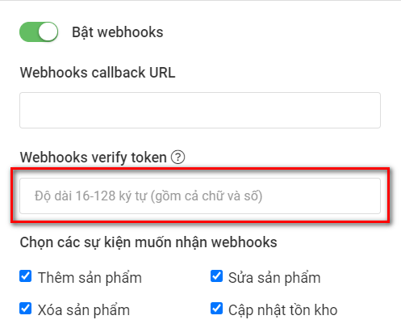
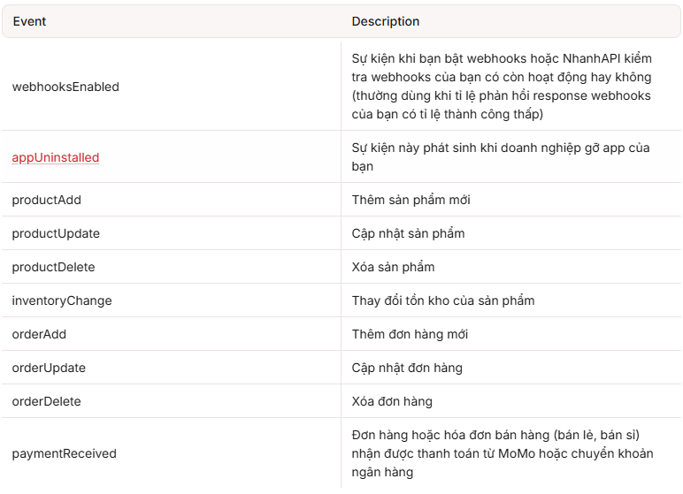
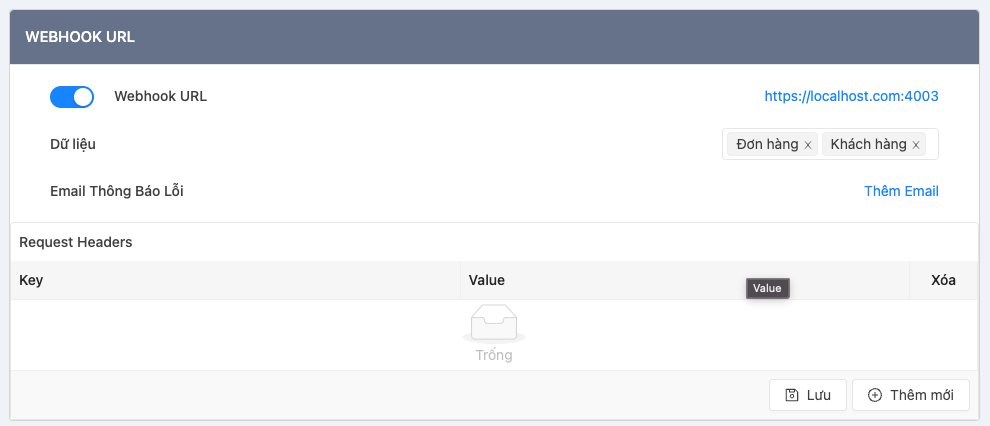

# Nemi product manager service

## Hướng dẫn tích hợp API: NhanhVN, Pancake, Sapo

- Tài liệu này hướng dẫn chi tiết các bước khởi tạo ứng dụng, lấy Access Token và gọi API từ 3 nền tảng: **NhanhVN**, **Pancake**, và **Sapo**.
---

## I. NhanhVN
### 1. Tạo và đăng nhập tài khoản
- Tài khoản: `0904858995`  
- Mật khẩu: `Dung@2005`

### 2. Tạo App
- AppID: `76158`  
- BusinessID: `214415`  
- SecretKey: (xem trong app) [NhanhVN App Detail](https://open.nhanh.vn/app/detail?id=76158)  
- Redirect URL: `https://nemi-dev.ecombase.net/redirect_url_1`


> ⚠️ **Lưu ý**: Tài khoản Nhanh.vn sẽ hết hạn sau 7 ngày, nếu không gia hạn hệ thống sẽ tự động tính phí duy trì

### 3. Lấy Access Code
Truy cập link sau:

```bash
https://nhanh.vn/oauth?version=3.0&appId=76158&returnLink=https://nemi-dev.ecombase.net/redirect_url_1
```

Kết quả trả về (ví dụ):

```
https://nemi-dev.ecombase.net/redirect_url_1?accessCode=0DECuIHCpplrYkvpRoGa441HDsZa0lCUhRA5Gvb128gNcoFT9M7ZUIm9x8gLKvXY
```

> ⚠️ **Lưu ý**: Access code chỉ có hiệu lực **10 phút** và sẽ hết hạn ngay khi đổi sang Access Token.

### 4. Đổi sang Access Token
Request bằng **cURL**:

```bash
curl --location --globoff 'https://pos.open.nhanh.vn/v3.0/app/getaccesstoken?appId={{appId}}&businessId={{businessId}}' --header 'Content-Type: application/json' --data '{
    "accessCode": "ACCESS_CODE",
    "secretKey": "APP_SECRET_KEY"
}'
```

Ví dụ Access Token trả về:

```bash
7HAh4AlUmvO9f67EhWaFFPFdGR0YOM57AGpJSpOONiqn6HDdovYcZaWAo19D2qB9tYZNNfUhUjqtDgBlWu8AhLNlSXw0Oaq11tCETJ1srFNu6nKDecPmAkpSlGYTrJtGQtv8lUqwGUeLEvE8PutVcuo5pDiQqcc9PrI5FznfnfGQj1IPpKOYRUvyufl6tBZ4z7wO6E86zkfCJmDXUPvMNyvetrG6y2MNlQwv6UYh3
```

### 5. Tài liệu API
- Các trạng thái tham khảo: [Model Constant](https://apidocs.nhanh.vn/v3/modelconstant#product-type)

---

## II. Pancake

### 1. Lấy API Key

- API Key: `10b76cf31be245848c8361287cee2adf`

### 2. Gọi API đơn hàng
Ví dụ request:

```bash
https://pos.pages.fm/api/v1/shops/1720119150/orders/8668902978?api_key=10b76cf31be245848c8361287cee2adf
```

Trong đó:
- `{shop_id} = 1720119150`
- `{order_id} = 8668902978`
- `{api_key} = 10b76cf31be245848c8361287cee2adf`

### 3. Proxy qua Localhost
```bash
http://localhost:8080/pancake/1720119150/orders/8668902978
```

Response ví dụ:

```json
{
  "status": "pending",
  "order_id": "22776",
  "order_code": "22776",
  "customer_name": "José Referente",
  "customer_phone": "09982393388",
  "shipping_address": "4INT Rizal Avenue Pob2 Nagcarlan Laguna back municipal building , Poblacion ii (pob.), Nagcarlan, Laguna",
  "payment_method": "COD",
  "shipping_method": "Standard",
  "total_price": 649.0,
  "shipping_fee": 0.0,
  "discount_amount": 0.0,
  "created_at": "2025-09-02T20:09:01.587660",
  "updated_at": "2025-09-03T10:13:45.370008"
}
```

---

## III. Sapo

### 1. Lấy chứng chỉ Client
Truy cập: [Sapo Developer - API Clients](https://developers.sapo.vn/services/partners/api_clients)


Ví dụ:
- API key: `50f184d93c834ebaa764cc17c25e31fa`
- Secret key: `50ce6b4d47a04ca18aa6f972b698779a`

Tạo shop tại: [Dev Shop](https://developers.sapo.vn/services/partners/dev_shop)  

- Shop: `Nemi`  
- Tài khoản: `nncuong377@gmail.com`  
- Mật khẩu: `Cuong?432000`

### 2. Xin cấp quyền (Authorization)
Redirect user đến URL:

```bash
https://{store}.mysapo.net/admin/oauth/authorize?client_id={api_key}&scope={scopes}&redirect_uri={redirect_uri}
```

Ví dụ với store `nemi`:

```bash
https://nemi.mysapo.net/admin/oauth/authorize?client_id=50f184d93c834ebaa764cc17c25e31fa&scope=read_content,write_content,read_themes,write_themes,read_products,write_products,read_customers,write_customers,read_orders,write_orders,read_script_tags,write_script_tags,read_price_rules,write_price_rules,read_draft_orders,write_draft_orders&redirect_uri=https://nemi-dev.ecombase.net/
```


Khi người dùng đồng ý, hệ thống sẽ redirect về:

```bash
https://nemi-dev.ecombase.net/?code=1dce6443b2284b7185e39d8065d5cd88&hmac=xxx&store=nemi.mysapo.net&timestamp=1757243040
```

- `code`: Authorization Code (dùng để lấy Access Token)

### 3. Lấy Access Token
Dùng `code`, `client_id`, và `client_secret`:

```bash
curl --location --request POST 'https://nemi.mysapo.net/admin/oauth/access_token?client_id=50f184d93c834ebaa764cc17c25e31fa&client_secret=50ce6b4d47a04ca18aa6f972b698779a&code=104ae3ce8c754b509e510021d660d3d4'
```

Response:

```json
{
  "access_token": "59d0c4eea0fc497e81733f693d3e4641",
  "scope": "read_content read_customers read_draft_orders read_orders read_price_rules read_products read_script_tags read_themes write_content write_customers write_draft_orders write_orders write_price_rules write_products write_script_tags write_themes"
}
```


👉 Access Token có hiệu lực **vĩnh viễn**.

### 4. Tạo request xác thực
Tất cả request gửi kèm header:

```http
X-Sapo-Access-Token: {access_token}
```


---

# Kết luận

- **NhanhVN**: OAuth 2 bước (Access Code → Access Token, ngắn hạn).  
- **Pancake**: Chỉ cần API Key, gọi trực tiếp.  
- **Sapo**: OAuth, nhưng Access Token vĩnh viễn.  


## Webhook Hands-on

### Nhanh.vn

- **Cấu hình webhook trên app:**



➡️ Sau khi cấu hình thành công sẽ nhận response **`webhooksEnabled`**

- **Webhook data:**
    - `event` (string): Tên sự kiện
    - `businessId`
    - `data` (json string)



---

### Pancake

- **Cấu hình webhook trên app:**



---

### Sapo

- **Call API tạo mới webhook:**

```http
POST /admin/webhooks.json
{
  "webhook": {
    "topic": "orders/create",
    "address": "http://whatever.hostname.com/",
    "format": "json"
  }
}
```

- **Response tạo webhook thành công:**

```
HTTP/1.1 201 Created
{
  "webhook": {
    "id": 987911590,
    "address": "http://whatever.hostname.com/",
    "topic": "orders/create",
    "created_on": "2016-01-20T13:01:10Z",
    "modified_on": "2016-01-20T13:01:10Z",
    "format": "json"
  }
}
```